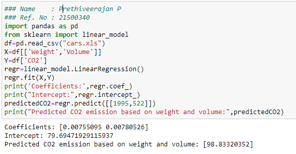

# Implementation of Multivariate Linear Regression
## Aim
To write a python program to implement multivariate linear regression and predict the output.
## Equipment’s required:
1.	Hardware – PCs
2.	Anaconda – Python 3.7 Installation / Moodle-Code Runner
## Algorithm:
### Step1:
Import Pandas library.
<br>

### Step2:
Import Linear_model from sklearn.
<br>

### Step3:
Read the csv file using pandas library.
<br>

### Step4:
Enter the parameters of the linear function.
<br>

### Step5:
Print the parameters of the linear function.
<br>

## Program:
```

#Name:Prethiveerajan P
#Ref. No:21500340

import pandas as pd
from sklearn import linear_model

df=pd.read_csv("Cars.xls")

x=df[['Weight', 'Volume']]
y=df['CO2']

regr=linear_model.LinearRegression()
regr.fit(x,y)

print('Coefficients: ', regr.coef_)
print('Intercept:', regr.intercept_)

predictedCO2=regr.predict([[3300, 1300]])
print('Predicted CO2 for the corresponding weight and volume:',predictedCO2)


```
## Output:



<br>

## Result
Thus the multivariate linear regression is implemented and predicted the output using python program.
